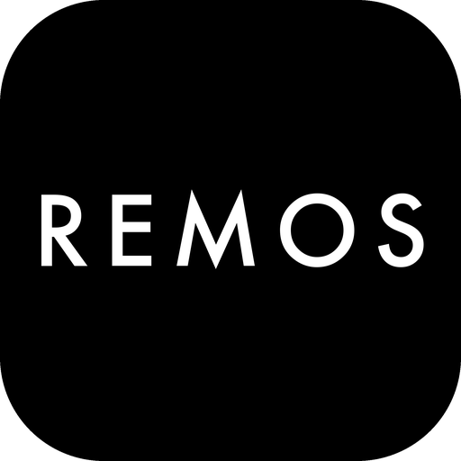
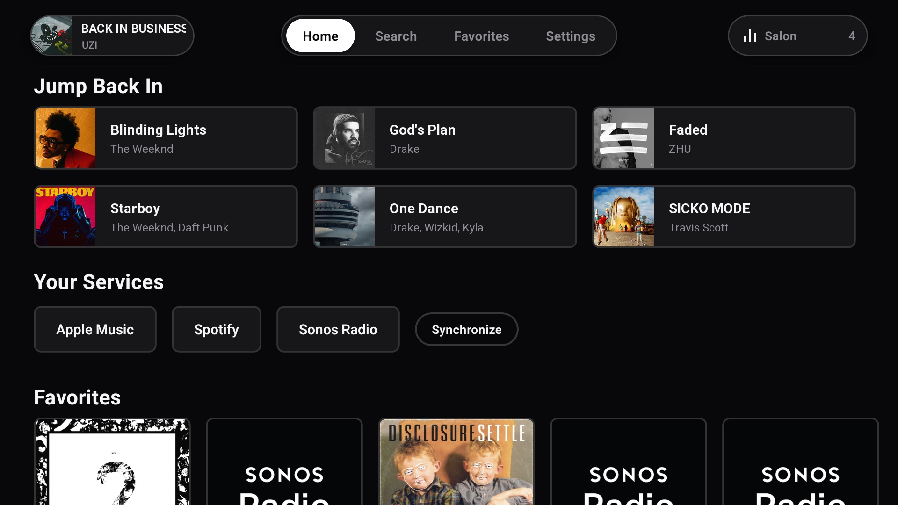
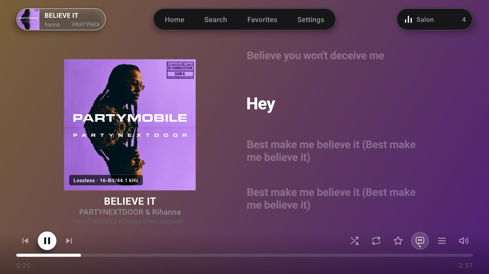
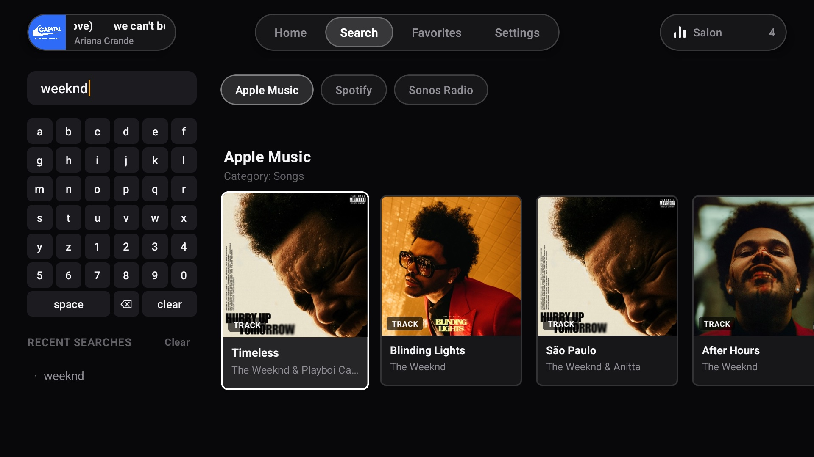
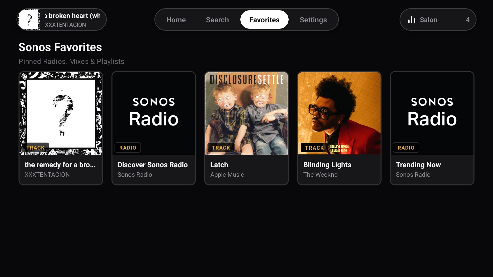
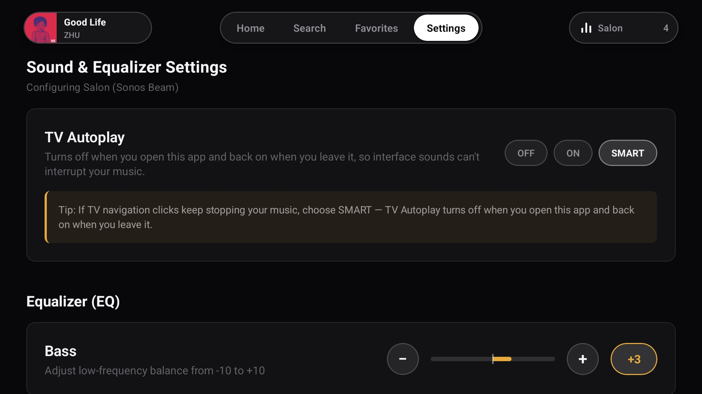

<p align="center">
  
</p>

<h1 align="center">Remos Player for Sonos</h1>

<p align="center">
  <b>Control your Sonos sound system from your TV remote</b><br>
  An unofficial Sonos controller for Android TV and Google TV, built with React Native
</p>

<p align="center">
  
  
  
  
  <a href="https://www.adgn.me/en/remos-for-sonos"></a>
</p>

> **Not affiliated with Sonos.** Remos Player is an independent project and is not affiliated with, endorsed by or sponsored by Sonos, Inc. Sonos is a trademark of Sonos, Inc. Android TV and Google Play are trademarks of Google LLC. The app relies on interfaces Sonos does not document, so a firmware update can break features without notice.

---

## ✨ Features

- **🔎 Search Your Music Services**: Browse and search Apple Music, Spotify, YouTube Music and Sonos Radio. Accounts you linked in the Sonos app are imported straight from the speaker with **Synchronize**, so there is nothing to log in to again.
- **📺 Smart TV Autoplay**: TV Autoplay normally switches your soundbar to TV audio on every interface click. **SMART** mode keeps it on for normal TV watching but pauses it while the app is open, and restores your setting when you leave, even if the app was force-closed.
- **🎧 Real Audio Quality**: See what the speaker actually reports, like `Lossless · 24-Bit/48 kHz` or `Dolby Atmos`, and the incoming format of the TV input (`Dolby Atmos (TrueHD)`, `PCM 2.0`, …).
- **🔊 Rooms as You Know Them**: A home theater with surrounds and a sub is one room, not four speakers, exactly like the Sonos app shows it.
- **🎛️ Only the Settings You Have**: EQ, loudness, night mode, speech enhancement, sub, surround and height audio appear only when your speaker supports them. The app asks the speaker instead of guessing from the model name.
- **🎵 Now Playing & Synced Lyrics**: Album art, queue, progress and time-synced lyrics from [LRCLIB](https://lrclib.net) on the big screen.
- **🎨 Dynamic Backgrounds**: The Now Playing background adapts its color to the current album art.
- **⭐ Favorites & Recently Played**: Your Sonos favorites and recent music, one click away.
- **🖥️ Made for the Remote**: Full D-pad navigation, an on-screen keyboard and 10-foot typography you can read from the couch.
- **🏠 No Account, No Cloud**: Everything runs between the TV and your speakers, on your own network.

---

## 📸 Screenshots

<p align="center">
  
  
</p>
<p align="center">
  
  
</p>
<p align="center">
  
</p>

---

## 🧪 Closed Beta

Remos Player is in **closed beta** on Google Play for Android TV and Google TV. Testers need:

- An Android TV or Google TV device (Chromecast with Google TV, NVIDIA Shield, Sony, TCL, Philips and others)
- Sonos S2 speakers on the same home network as the TV (S1-only speakers are not supported)
- A Google account signed in to Google Play on that TV
- Optional: music services linked in the Sonos app, if you want to search them

The app is free for everyone during the beta. **[Apply for the beta →](https://www.adgn.me/en/remos-for-sonos#apply)**

### Roadmap

| When  | Milestone           | Details                                                  |
| ----- | ------------------- | -------------------------------------------------------- |
| Now   | Closed Beta         | Android TV and Google TV                                 |
| Next  | Open Beta           | An open test group on Google Play that anyone can join   |
| Then  | Google Play Release | Public release for Android TV and Google TV              |
| Later | Apple TV            | A tvOS version on the App Store                          |

### Planned

- **Apple TV support**: a tvOS version built for the Siri Remote
- **Room grouping**: group and ungroup speakers from the TV
- **Queue editing**: reorder the queue and remove songs
- **Sleep timer**: stop the music after a set time
- **Remote buttons in the background**: play, pause and skip while another app is open
- **Home screen cards**: Now Playing, favorites and recent music on the Android TV home screen
- **More music services**: TIDAL, Amazon Music, Deezer and others linked in the Sonos app
- **More languages**: Turkish and others

---

## 🛠 Technical Overview

| Area      | Technology                                   |
| --------- | -------------------------------------------- |
| Framework | React Native (`react-native-tvos`)           |
| Language  | TypeScript, Kotlin (native artwork colors)   |
| Speakers  | UPnP / SOAP over the local network           |
| Services  | Sonos Music API (SMAPI)                      |
| Lyrics    | [LRCLIB](https://lrclib.net/)                |
| Data      | TanStack Query, AsyncStorage                 |

### How It Talks to Sonos

The app speaks to the speakers directly on your LAN; there is no backend.

| What                 | How                                                                                                    |
| -------------------- | ------------------------------------------------------------------------------------------------------ |
| Rooms & groups       | UPnP `ZoneGroupTopology#GetZoneGroupState`, one entry per group, addressed through its coordinator     |
| Playback, volume, EQ | UPnP SOAP on port 1400 (`AVTransport`, `RenderingControl`, `DeviceProperties`)                         |
| Supported settings   | Each setting is read from the speaker; a UPnP fault means "not supported". TV input = `HTControl`      |
| Linked accounts      | Decrypted from `ThirdPartyMediaServersX` in the first `ZoneGroupTopology` event                        |
| Search & browse      | The SMAPI endpoint of each linked service, using those accounts                                        |
| Audio quality        | The speaker's local Control API (`playbackMetadata`)                                                   |
| TV Autoplay          | `DeviceProperties#Get/SetAutoplayRoomUUID` with `Source="TV"`                                          |

---

## 🚀 Getting Started

### Prerequisites

- **Node.js**: >= 20.x
- **Yarn**: 1.22+
- **Java**: Version 17 (for Android builds)
- **Android Studio** with the Android SDK, or `adb` access to a physical TV
- A Sonos S2 system on the same network as the TV or emulator

### Installation

1. Clone the repository: `git clone https://github.com/alidogangullu/Remos-Player.git`
2. Install dependencies: `yarn install`
3. Start Metro: `yarn start`
4. Build for Android TV: `yarn android:tv`

To run on the emulator, create an Android TV AVD named `Android_TV_API36` and start it with `yarn emulator:tv`. Note that the emulator usually can't see Sonos speakers on your LAN, so a physical TV is recommended.

To run on a physical TV, enable developer options and network debugging on the TV, then connect with `adb connect <tv-ip>:5555`.

> Development and testing happen on Android TV. The Apple TV (tvOS) project in `ios/` is not verified yet and will be brought up to date before the App Store release.

### Project Structure

```
src/
├── components/     # Shared UI (common/) and TV focus-aware controls (tv/)
├── features/       # Screens: home, nowPlaying, search, services, settings, system, …
├── services/
│   ├── sonos/      # upnp, discovery, gena, smapi, accounts, security, autoplay
│   ├── lyrics/     # LRCLIB client
│   └── history/    # Recently played
├── theme/          # Colors and spacing
└── types/
android/            # Android TV project, incl. the native artwork-color module
docs/screenshots/   # README screenshots and app icon
```

---

## ⚠️ Known Limitations

- Development happens on a Sonos Beam (Gen 2) with Play:1 surrounds; other setups are what the beta is for.
- Speech enhancement is shown as on/off on all speakers. Leveled speech enhancement (Arc Ultra) is not supported.
- SMART TV Autoplay can't restore the original setting if the app is killed and never opened again. Opening the app once fixes it.

---

## 🤝 Contributing

Issues and pull requests are welcome. Because most of what the app relies on is undocumented, please include your speaker model and firmware version (Sonos app → Settings → System → About) when reporting a bug.

Before opening a pull request:

```bash
npx tsc --noEmit
yarn lint
```
